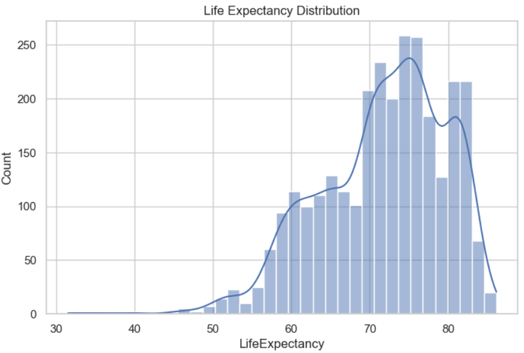
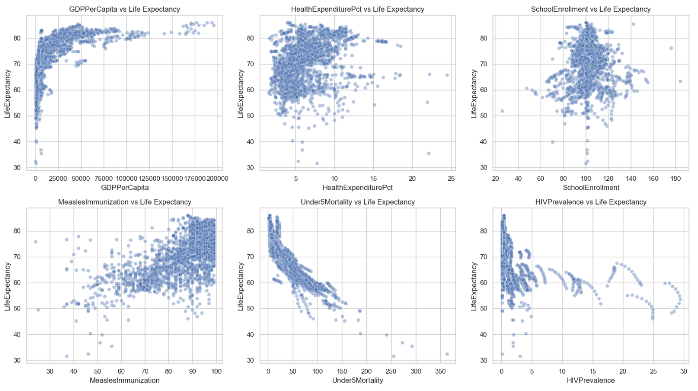
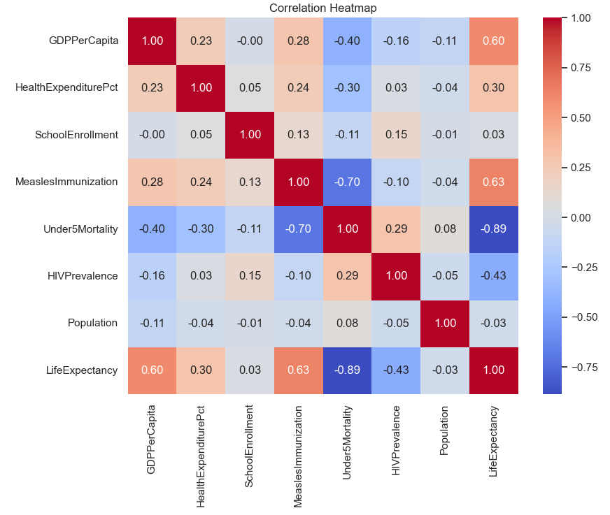
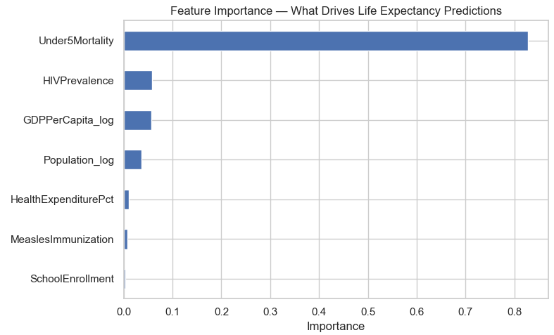
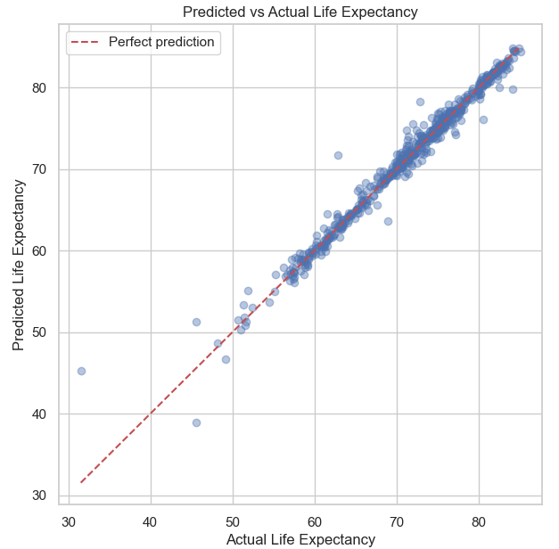
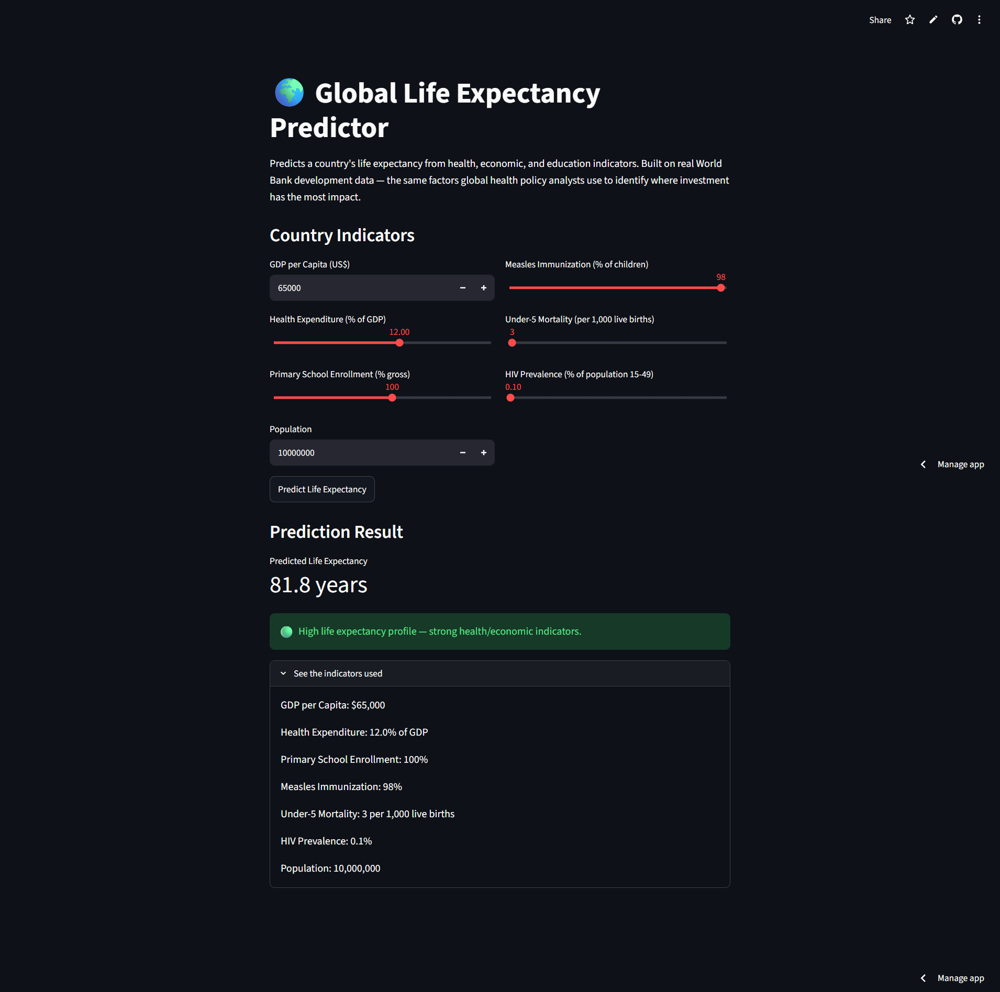
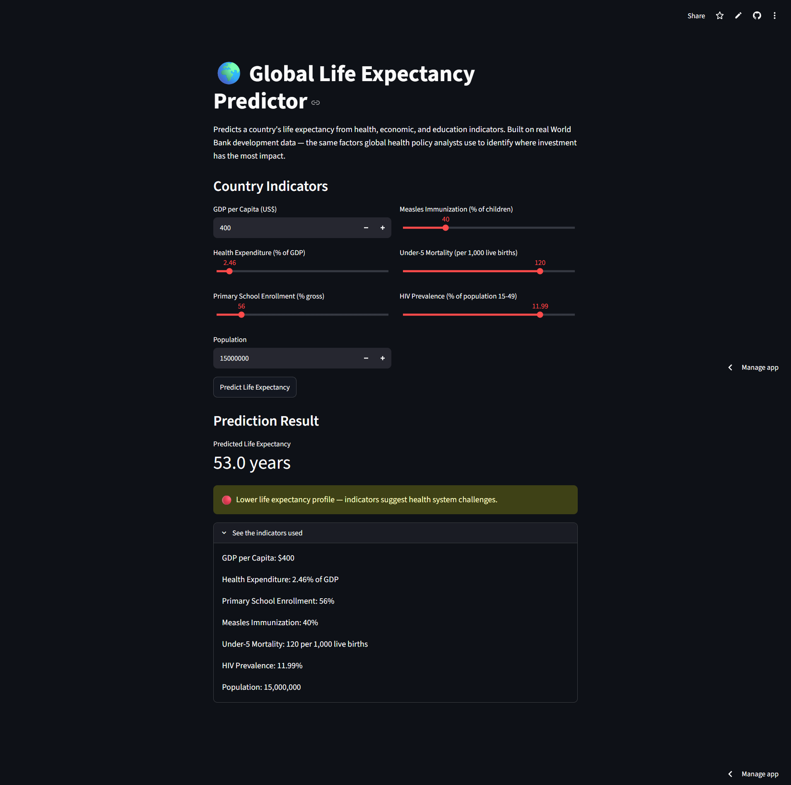

# Global Life Expectancy Prediction

Predicting a country's life expectancy from real health, economic, and education indicators — sourced directly from the World Bank, not a pre-cleaned Kaggle CSV. Identifies which factors most influence health outcomes, relevant to global health policy prioritization.

## Problem Statement

**Understanding which development factors most influence life expectancy helps policymakers and global health organizations prioritize limited resources where they'll have the greatest impact. This project builds a predictive model on real World Bank development data — spanning health, economic, and education indicators across countries and years — to quantify these relationships, and identifies countries whose actual outcomes diverge from what their indicators would predict, flagging cases worth deeper policy investigation.**

## Dataset

- **Source:** [World Bank World Development Indicators](https://databank.worldbank.org/source/world-development-indicators) — official institutional data, queried and exported directly, not a Kaggle mirror
- **Indicators used:** Life expectancy, GDP per capita, health expenditure, primary school enrollment, measles immunization rate, under-5 mortality, HIV prevalence, population
- **Format:** Multi-country, multi-year panel data, self-assembled via World Bank's DataBank query tool

## Approach

1. **Data Acquisition** — queried 8 real indicators across all countries and multiple years directly from World Bank DataBank, exported as CSV
2. **Reshaping** — converted from the World Bank's wide year-column export format into a clean, model-ready country-year row structure (a genuine real-world data engineering step, not something a typical Kaggle CSV requires)
3. **Cleaning** — handled World Bank's `'..'` missing-value convention, imputed missing indicators using year-specific medians (not a single global median, to account for reporting quality changing over time)
4. **EDA** — examined relationships between each indicator and life expectancy
5. **Feature Engineering** — log-transformed GDP per capita and Population to correct heavy skew
6. **Modeling** — compared Linear Regression, Random Forest, and XGBoost; tuned the best model with GridSearchCV
7. **Explainability** — feature importance analysis showing which indicators drive predictions most
8. **Policy Framing** — identified countries whose actual life expectancy diverges most from what their indicators predict, flagging cases worth deeper investigation

## Key Results

| Model | R² | MAE (years) | RMSE (years) |
|---|---|---|---|
| Linear Regression | 0.906 | 1.84 | 2.49 |
| Random Forest | 0.982 | 0.64 | 1.10 |
| XGBoost (tuned) | **0.979** | **0.63** | **1.18** |

**Note: Random Forest achieved a marginally higher R² than tuned XGBoost — the two performed comparably, with XGBoost selected as the final model for its slightly lower MAE and consistency with the modeling approach across other projects in this portfolio.**

**Top predictive features (by importance):**
1. **Under5Mortality** (0.828) — by far the dominant predictor; child mortality rate strongly reflects overall healthcare system quality and access
2. **HIVPrevalence** (0.058) — infectious disease burden remains a meaningful factor even after accounting for child mortality
3. **GDPPerCapita_log** (0.056) — economic resources matter, but far less than direct health outcomes like child survival

## Business/Policy Impact

**The residual analysis highlights countries whose actual life expectancy differs significantly from the model's prediction. Under-performing countries (actual < predicted) may face additional challenges—such as political instability, conflict, healthcare accessibility, or socioeconomic inequalities—not captured by the selected features. Conversely, over-performing countries (actual > predicted) may benefit from effective public health policies, stronger healthcare systems, or other positive factors beyond the model's inputs. These cases represent valuable opportunities for further investigation and demonstrate that, while the model captures the major determinants of life expectancy, external real-world factors also play an important role.**

## How to Run

```bash
git clone <your-repo-url>
cd life-expectancy-prediction

conda create -n lifeexp python=3.10 -y
conda activate lifeexp
pip install -r requirements.txt

jupyter notebook life_expectancy_project.ipynb
streamlit run app.py
```

## Live Demo

🔗 [Try the app here](https://life-expectancy-prediction-rvqedwr5wayv4c53czw9cq.streamlit.app/)

## Screenshots

**Life expectancy distribution:**


**Feature relationships — scatter plots vs. life expectancy:**


**Correlation heatmap:**


**Feature importance — Under-5 Mortality dominates as the strongest predictor:**


**Predicted vs. actual life expectancy — near-perfect alignment (R² = 0.979):**


**Live app — high-indicator country profile (81.8 years predicted):**


**Live app — low-indicator country profile (53.0 years predicted):**


A **28.8-year spread** between the two extreme test profiles — consistent with real-world differences between the highest and lowest life-expectancy countries globally.

## Tech Stack

Python · pandas · scikit-learn · XGBoost · World Bank Open Data · Streamlit
